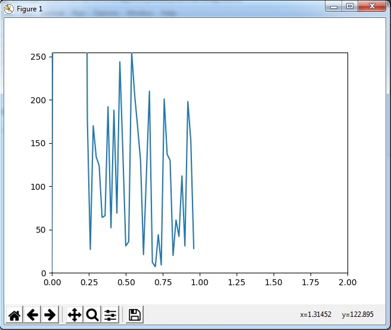

# Micropython - python esp8266 project
On line visualization of ADC GPIO value. The client-server architecture is implemented with a tcp socket. Visualization with matlab and logging into csv file.

